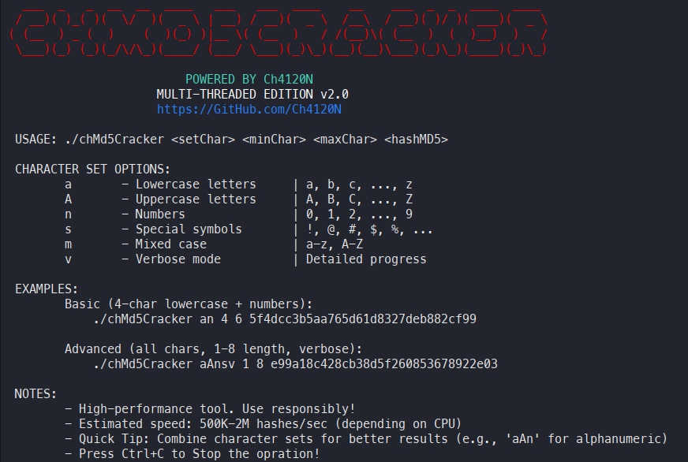
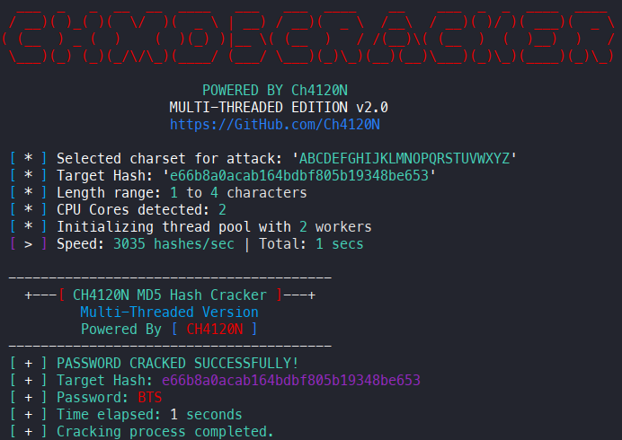

<head>
  <meta name="google-site-verification" content="l4gzIHopgDDt57xRYeRvJZ5DYgg4lLb-qPciUxhNxkY" />
</head>

# **Ch4120N MD5 Hash Cracker**
### _**Multi-Threaded MD5 Hash Cracker with Smart Distribution**_

---

> **Ch4120N MD5 Hash Cracker** is a powerful, high-performance, cross-platform MD5 hash cracking tool with multi-threading support and intelligent workload distribution.

---

## 👨‍💻 Project Programmer

> **Ch4120N** — [Ch4120N@Proton.me](mailto:Ch4120N@Proton.me)

---
## 🧠 Made For

> **Security professionals** and **penetration testers** who require a powerful **MD5 hash cracker** with **intelligent workload distribution** for **authorized security audits**, **forensic analysis**, and **password recovery**.

---

## 🖼️ Screenshots

| Usage | Cracking Progress
| :---: | :---:
|  | 

---
